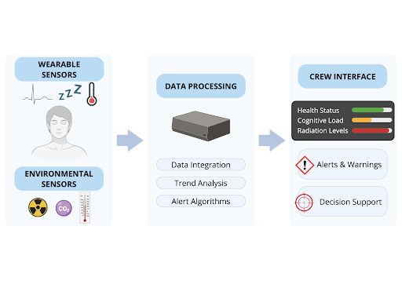

# Concept of operations (ConOps): Integrated health monitoring and situational awareness

**Group Project Deliverable 2**

**INTEGRATED HEALTH MONITORING AND SITUATIONAL AWARENESS FOR AUTONOMOUS SPACEFLIGHT LONG-DURATION MISSIONS**

This document states the envisioned concept of operations for the integrated health monitoring approach described below. Content is organized for traceability; it does not add requirements beyond what is written in each section.

---

## Introduction

### Project description

#### Background

Long-duration spaceflight missions expose astronauts to extreme physiological and psychological stressors, including microgravity or partial-gravity environments, radiation exposure, sleep disruption, isolation, and high workload, among others. Current in-flight health monitoring relies on multiple independent wearables, such as temperature sensors, sleep monitors, and radiation dosimeters, that collect physiological, behavioural, and environmental data [1]. However, these systems present data separately and primarily for post hoc analysis by ground teams, rather than for real-time crew decision-making. As exploration missions move beyond low Earth orbit (LEO), communication delays and increased crew autonomy will require astronauts to interpret health data independently while operating under fatigue or stress. Fragmented situational awareness increases cognitive workload, degrades performance monitoring, and may delay detection of critical health issues such as stress overload, arrhythmias, illness onset, sleep deprivation, or radiation-related effects.

NASA’s Human Research Program (HRP) identifies adverse in-flight medical conditions [2] and performance decrements due to sleep loss and workload [3] as critical risks for long-duration exploration missions. Astronauts frequently experience insufficient sleep [4] and may not perceive performance degradation [5], underscoring the need for objective, integrated trend-monitoring systems. Historical examples demonstrate the operational impact of monitoring, as it can affect mission performance [6]. Therefore, the goal of the proposed system is to develop an integrated health monitoring and situational awareness platform that synthesizes multi-source data into a unified, interpretable interface for real-time crew use. Its objectives are to reduce workload, enable early detection of health and performance issues, and support autonomous medical decision-making during missions beyond LEO.

---

## Assumptions and constraints

The primary users are astronauts participating in long-duration missions beyond LEO. These missions will involve significant communication delays with ground control, requiring crew autonomy in operational decision-making and medical assessment. Furthermore, it is assumed that astronauts will already be equipped with multiple wearables and environmental monitoring devices that collect both physiological and environmental data. Therefore, the proposed system integrates and synthesizes existing sensor technologies rather than developing entirely new biomedical hardware. Finally, it is assumed that the data can be collected and transmitted continuously or periodically to an onboard processing system.

Regarding constraints, the system must minimize mass, volume, and power consumption, and operate reliably in microgravity, partial gravity, elevated radiation exposure, vibration, and varying thermal conditions. Furthermore, since astronauts might experience workload overload and fatigue, the interface must minimize complexity and avoid contributing to information overload. Moreover, all medical data must be secured and transmitted, maintaining crew privacy standards. Finally, the system must be robust to sensor failure, data dropouts, and hardware anomalies.

---

## Overview of the proposed system

The proposed system is an integrated, human-centered health monitoring and situational awareness platform designed to provide situational awareness and support autonomous decision-making during long-duration space missions. It collects physiological, behavioural, and environmental data from existing wearable and onboard sensors, processes these inputs onboard, and presents synthesized health and performance indicators through an intuitive interface. By converting fragmented biomedical data into actionable insights, the system reduces cognitive workload, enables early detection of health and performance degradation, and enhances crew autonomy for missions beyond low Earth orbit.

---

## Applicable references (documents and standards)

The documents and standards applicable to this system include the “NASA-STD-3001, Spaceflight Human-System Standard, Volume 1 and 2”, which defines Agency-level medical, human performance, environmental, and human-system integration requirements for the design and operation of human spaceflight systems. Volume 1 [7] addresses crew health and medical operations, while Volume 2 [8] covers human-machine interfaces and operational constraints. NASA’s Human Integration Design Handbook [9] and Human Systems Engineering Handbook [10] provide design guidance to ensure systems accommodate human capabilities and limitations across mission phases. Finally, the NASA Technology Taxonomy [11] helps contextualize technology areas and disciplines relevant to this system’s development, particularly in biomedical and human-system integration domains.

---

## Envisioned system: needs, goals, and objectives

The system addresses the need for an integrated, crew-centered health monitoring capability that supports autonomous operations during long-duration space missions beyond LEO. The primary goal of the system is to enhance astronaut situational awareness by synthesizing multi-source health and performance data into actionable information. The objectives are to (1) integrate physiological, behavioural, and environmental inputs into a unified framework; (2) provide intuitive visualization of trends and risk indicators; (3) enable early detection of health and possible performance degradation; and (4) support crew decision-making under conditions of fatigue, workload, and communication delay with the ground.

---

## Key system elements (overview)

The system contains five elements: (1) the **crew member**, who functions as both the monitoring subject and the primary stakeholder; (2) **wearable and environmental sensors** that collect physiological, behavioural, and environmental data; (3) a **Health Monitoring Unit (HMU)** that aggregates multi-source inputs and performs real-time analysis and trend detection; (4) **decision support and alert module** that generates prioritized risk indicators; and (5) **a crew interface display** that presents the synthesized information in an intuitive and workload-sensitive manner.

**Figure 1:** High-level architecture of the integrated health monitoring system showing sensor inputs (left), onboard data processing (middle), and crew interface (right).

---

## Human-system interfaces

An onboard display will serve as the primary human-system interface, presenting synthesized health and performance indicators in a clear format. Rather than displaying raw sensor data, the interface will provide trend visualizations, simplified health indices, and color-coded risk levels to reduce cognitive workload. The system will provide intuitive interaction via touch or cursor-based input and will enable the crew to access detailed data layers as needed. The interface is designed to manage workload and maintain usability under varying lighting conditions and fatigue.

---

## Modes of operation

The system has four main operational modes. In **Nominal Monitoring Mode**, physiological and environmental data are continuously integrated and presented as baseline trends and health status indicators. During **Alert Mode**, the system identifies deviations from predefined thresholds and provides prioritized alerts and suggested responses. In the **Degraded Mode**, the system provides partial functionality in the case of sensor or data loss, with clear indications of reduced data integrity. Finally, during the **Ground-Supported Mode**, health information can be relayed to ground-based medical teams if communication is established, allowing for additional analysis and support.

---

## Proposed capabilities

Capabilities will include simplified health status indicators and predictive risk flags to support early detection of performance degradation, illness onset, or fatigue accumulation. The alerts given to the crew will be prioritized based on operational relevance and offer decision-support recommendations when thresholds are exceeded. The system will maintain partial functionality during sensor degradation or data loss and notify the crew accordingly. Furthermore, when communication is available, it enables data transmission to ground medical teams for supplemental review.

---

## Physical environment

The integrated system is expected to be used throughout the mission, including ascent and descent (g-forces), cruise (microgravity), and surface exploration phases (partial gravity). Crews are expected to wear the wearable devices, except during operations that require changes to the nominal conditions of the wearable material, such as an EVA. The central data-processing computer and its display are located in the crew habitat module's living quarters, so the basic atmospheric/thermal/light condition is maintained (see the typical specifications for a life-supportive environment [8]).

---

## Operational scenarios and use cases

### Nominal conditions

Under **regular monitoring routine** (1), the crew continuously wear the wearable devices as part of their regular health‑monitoring operations. The devices continuously monitor each crew member’s vital information and, via a Bluetooth connection, periodically transmit this data to the onboard Health Monitoring Unit (HMU). The HMU analyzes incoming data, generates a detailed health report, stores it on board, and transmits it to the display interface and, if possible, to mission control for review by flight surgeons. A **daily analysis reporting** (2) is generated and presented on a display in the cabin for crews. It may reduce the amount of information relative to that transmitted to flight surgeons and include interpretable figures such as sleeping score, health score, and activity score. An **exercise-specific monitoring configuration** (3) is activated during scheduled crew exercise activities. This mode switches the wearable device's specific monitoring conditions. **Alert mode** (4) is triggered only when it detects a potential health issue, increased workload, or fatigue. This includes acute cardiovascular issues, such as detecting arrhythmia patterns, a marked drop in blood oxygen saturation, and a very low or very high respiratory rate.

### Off-nominal conditions

Under off‑nominal conditions, the system must support scenarios involving crew error, device malfunction, low performance, and unexpected environmental factors. Crews may be unable or unwilling to wear the device continuously because of discomfort, skin irritation (including maceration), moisture accumulation, allergic reactions, restrictions during IVA activities, forgetting to wear or charge it, or the need to remove it during emergencies. The HMU itself may lose data from communication issues or radiation events, thermal stress from direct sunlight or nearby equipment, mechanical shock or mishandling, or degradation over long‑term use. Even when functioning, the system may produce low‑quality data due to unreliable measurements, improper attachment, inadequate sensor calibration for individual crew members, performance degradation over time, or failures in data fusion.

---

## Risks and potential issues

Several human-system risks and potential issues are associated with the proposed system's operations. First, the proposed system may present an excessive number of indicators, alerts, and reports, which can cause cognitive fatigue among crews. In this project, we treat this challenge as a primary focus, as the system's objective is to synthesize health reports by combining multiple wearable and environmental data sources into an interpretable display.

Second, there is potential for information misuse and confusion in decision-making regarding the mitigation of crew health issues. If the system's analysis is unreliable or difficult to interpret, the crew may lose trust in the system and underutilize it. On the other hand, if crews over-rely on the health-monitoring analysis, it may reduce their ongoing self-monitoring and situational awareness of their own state. In either case, poor reconciliation of insights among the crew, flight surgeons, and the system can degrade team performance and delay effective operations.

Finally, privacy and psychological issues can become salient. Continuous monitoring of physiological parameters can feel intrusive and may increase stress, which is further exacerbated by isolated, confined environments. If the daily reports become monotonous, the crew may lose motivation to consistently use the devices, resulting in improper attachment, passive noncompliance over time (e.g., not checking the daily report), or increased psychological burden associated with device use.

---

## Acronyms

| Acronym | Expansion |
|---------|------------|
| NASA | National Aeronautics and Space Administration |
| LEO | low Earth orbit |
| HRP | Human Research Program |
| HMU | Health Monitoring Unit |
| EVA | Extravehicular Activity |
| IVA | Intravehicular Activity |

---

## Summary for tooling / implementation

Use this block as a quick checklist when aligning implementation or downstream docs to this ConOps (stated content only):

- **Users / mission class:** Astronauts on long-duration missions beyond LEO; significant communication delays with ground; crew autonomy in operational decision-making and medical assessment (as stated).
- **Sensors / hardware scope:** Assumes multiple wearables and environmental monitoring devices already collecting physiological and environmental data; system integrates/synthesizes rather than developing entirely new biomedical hardware; data may be collected and transmitted continuously or periodically to onboard processing (as stated).
- **Constraints:** Minimize mass, volume, power; reliable operation in microgravity, partial gravity, elevated radiation, vibration, varying thermal conditions; interface minimizes complexity and avoids information overload; medical data secured and transmitted with crew privacy standards; robust to sensor failure, data dropouts, hardware anomalies (as stated).
- **Five elements (as listed):** Crew member; wearable and environmental sensors; HMU (aggregate, real-time analysis, trend detection); decision support and alert module; crew interface display.
- **HSI (as stated):** Onboard display primary; trend visualizations, simplified health indices, color-coded risk levels; touch or cursor input; detailed layers as needed; usability under varying lighting and fatigue.
- **Modes (as named):** Nominal Monitoring; Alert; Degraded; Ground-Supported (definitions as in section “Modes of operation”).
- **Physical environment (as stated):** Use across ascent/descent (g-forces), cruise (microgravity), surface (partial gravity); wearables except when nominal wearable conditions must change (e.g., EVA); central computer/display in habitat living quarters with basic atmospheric/thermal/light maintained per [8] as cited.
- **Nominal scenario bullets explicitly listed:** (1) regular monitoring routine with Bluetooth periodic transmit to HMU, reports to display and possibly mission control; (2) daily analysis reporting with possible reduced detail vs flight surgeons and scores listed; (3) exercise-specific monitoring configuration; (4) alert mode triggers and example acute conditions as written.
- **Risks called out:** Cognitive fatigue from too many indicators/alerts/reports; trust/over-reliance and reconciliation across crew/flight surgeons/system; privacy/psychological burden and habituation to daily reports (as written).

---

## References

[1] National Aeronautics and Space Administration, “Wearable Tech for Space Station Research,” NASA, https://www.nasa.gov/missions/station/iss-research/wearable-tech-for-space-station-research/. Accessed: 5 Feb. 2026.

[2] Antonsen, E., Bayuse, T., Blue, R., Daniels, V., Hailey, M., Hussey, S., Kerstman, E., Krihak, M., Latorella, K., Mindock, J., Myers, J., Mulcahy, R., Reed, R., Reyes, D., Urbina, M., Walton, M., “Evidence Report: Risk of Adverse Health Outcomes and Decrements in Performance Due to In-Flight Medical Conditions,” NASA Johnson Space Center, Houston, TX, 2017.

[3] Flynn-Evans, E., Gregory, K., Arsintescu, L., Whitmire, A., ”Evidence Report: Risk of Performance Decrements and Adverse Health Outcomes Resulting from Sleep Loss, Circadian Desynchronization, and Work Overload,” NASA Johnson Space Center, Houston, TX, 2016.

[4] Barger, L. K., Flynn-Evans, E. E., Kubey, A., Walsh, L., Ronda, J. M., Wang, W., Wright, K. P., and Czeisler, C. A., “Prevalence of Sleep Deficiency and Use of Hypnotic Drugs in Astronauts before, during, and after Spaceflight: An Observational Study,” *The Lancet Neurology*, Vol. 13, No. 9, 2014, pp. 904–912. https://doi.org/10.1016/S1474-4422(14)70122-X

[5] Van Dongen, H. P. A., Maislin, G., Mullington, J. M., and Dinger, D. F., “The Cumulative Cost of Additional Wakefulness: Dose-Response Effects on Neurobehavioral Functions and Sleep Physiology From Chronic Sleep Restriction and Total Sleep Deprivation,” *Sleep*, Vol. 26, No. 2, 2003, pp. 117–126. https://doi.org/10.1093/sleep/26.2.117

[6] Johnston, R. S., Dietlein, L. F., and Berry, C. A., “Biomedical results of Apollo,” Washington, D.C: Scientific and Technical Information Office, National Aeronautics and Space Administration, 1975.

[7] National Aeronautics and Space Administration, NASA-STD-3001, Volume 1: NASA Space Flight Human-System Standard – Crew Health, NASA Headquarters, Washington, DC, Current Revision.

[8] National Aeronautics and Space Administration, NASA-STD-3001, Volume 2: NASA Space Flight Human-System Standard – Human Factors, Habitability, and Environmental Health, NASA Headquarters, Washington, DC, Current Revision.

[9] National Aeronautics and Space Administration, *Human Integration Design Handbook (HIDH)*, NASA/SP-2010-3407, NASA Headquarters, Washington, DC, 2010.

[10] National Aeronautics and Space Administration, *NASA Systems Engineering Handbook*, NASA/SP-2016-6105 Rev. 2, NASA Headquarters, Washington, DC, 2016.

[11] National Aeronautics and Space Administration, *NASA Technology Taxonomy*, NASA Headquarters, Washington, DC, 2024.
